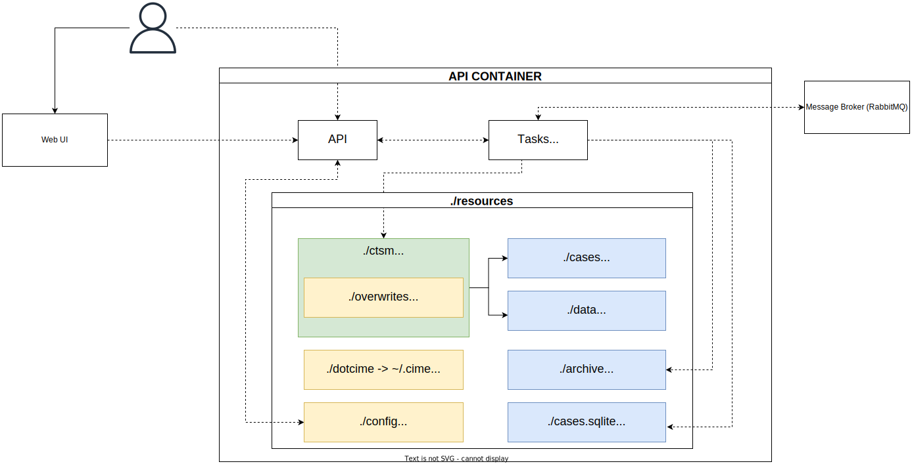

# CTSM API

## 2.2 Implementation

Running a FATES-enabled land model requires access to High-Performance Computing (HPC) resources and a moderate level of computer skills to set up, configure, and run the models.

Even though the former requirement becomes less relevant if the simulation scale is small, e.g., when running the model for a single point, the latter can be a challenge for most users.

To run such models on more accessible resources like personal computers, users must go through the following steps:

1. Install and configure the dependencies for the model
2. Set up and configure the model
3. Prepare the required data for their use cases
4. Configure the case they want to run

The goal of the NorESM FATES Platform (referred to as the Platform from here forward) is to abstract most of these steps, so end-users can avoid them and instead focus on running their cases and easily access the output data for further analysis.

The target audience for this project is the end-users of the model, specifically those with limited computing skills.

The Platform is designed for land models based on [ESCOMP Community Terrestrial System Model (CTSM)](https://github.com/escomp/ctsm) with support for FATES.
We have used [Norwegian Earth System Model (NorESM)](https://github.com/NorESMhub/NorESM), [`release-nlp0.1.0`](https://github.com/NorESMhub/NorESM/tree/release-nlp0.1.0), for this paper.
This version is based on [CTSM version `ctsm5.1-dev038`](https://github.com/ESCOMP/CTSM/tree/ctsm5.1.dev038).

The following section describes our solutions to the steps mentioned above.

### 2.2.1 Install and configure the dependencies for the model

CTSM and NorESM depend on many external libraries, which can be challenging to install on a personal computer.
The difficulties can be due to a lack of cross-platform support, version conflict with existing libraries, or system architecture.

One solution to this is containerization, which is the process of packaging and distributing software in a way that can be run on various platforms.
Containers use Operating System-level virtualization. This allows efficient use of resources while isolating the software from other processes running on the host system.
All the requirements for packaged software are included in the container.

We used [Docker](https://www.docker.com/) for this purpose. Docker is a widely used and popular containerization tool.
The packaged software is called an Image. When a Docker Image is run, it is called a Container, i.e., a running instance of the software.

The main Image created for the Platform is [ctsm-api](https://github.com/NorESMhub/ctsm-api/pkgs/container/ctsm-api).
It contains all the dependencies for the model, the scripts to initialize and configure the model, and the API code that provides access to the model.

The Image can be configured via an environment file (`.env`), which gives control to users to adjust some initial properties of the model and the Platform, e.g., what version of the model to use and what drivers should be enabled.

In order to allow easier maintenance and better use of resources, some dependencies are not included in the Image.
For example, the message queuing broker (RabbitMQ) required by the API, which is needed to manage asynchronous communications between the model and the API, is not included.
This service can be added by using the official [RabbitMQ Docker Image](https://hub.docker.com/_/rabbitmq).
Keeping this service out of the Image lets more savvy users pick a different message broker for their use cases.

To address the needs of non-technical users, we have taken care of the extra configurations for the containers by using an orchestration tool called [Docker Compose](https://docs.docker.com/compose/overview/).
Docker Compose is a wrapper around Docker, which allows configuring and organizing all the containers in a single `YAML` file.

In addition to the previously mentioned Images, we have included an Image for Jupyter Server and one for our Web User Interface (UI) for `ctsm-api`.
